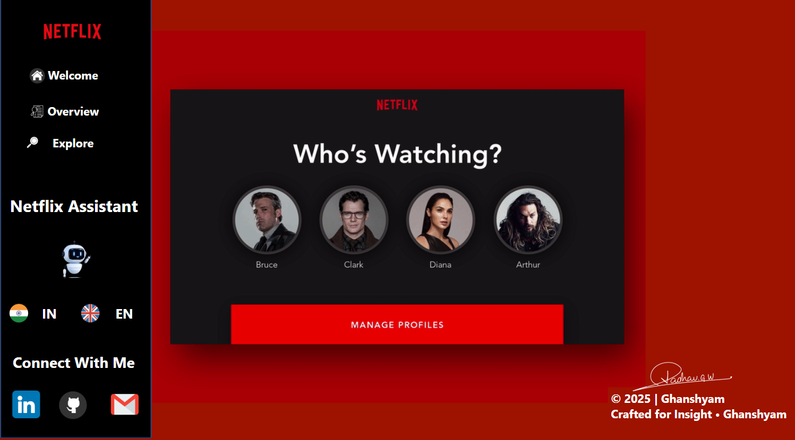

# 🎬 Netflix Data Analysis Dashboard  
**Designed & Developed by Ghanshyam Jadhav**

---

## 📌 Project Overview  
This project is a Power BI-based interactive dashboard built using a Netflix dataset. It explores content trends including release years, genres, types, countries, and ratings. The objective is to derive actionable insights from the Netflix catalog using visual storytelling.

---

## 📊 Dashboard Overview

---

## 🛠 Technologies Used  
- **Power BI** – Data visualization  
- **Power Query** – Data transformation  
- **DAX** – Data modeling and calculations  
- **Excel/CSV** – Dataset handling  
- **Remove.bg / Figma** – UI & Signature enhancements

---

## 📂 Dataset Information  
- **Source**: Public Netflix dataset  
- **Rows**: 8,800+ titles  
- **Fields Used**:
  - Title, Type, Genre, Country, Year, Rating, Runtime, Language, Votes, Cast
- **Categories**:
  - Type: Movie, TV Show, Mini Series, Special
  - Genre: Comedy, Drama, Documentary, Action, etc.
  - Country: 83 unique production origins
  - Year Range: 1950–2025

---

## 🔄 Data Processing  
- Removed null and duplicate entries  
- Split multi-value columns (e.g., genres, countries)  
- Converted fields to proper data types  
- Added calculated fields (e.g., Decade, Release Group)  
- Filtered and sorted for clean visual representation

---

## 🧠 Modeling Approach  
- Used a star schema structure  
- One fact table: `Netflix Titles`  
- Lookup tables for genres, countries, years  
- DAX measures for KPIs like:
  - Total Titles  
  - Avg Rating  
  - Country Count  
  - Yearly Growth  
  - Top Genres  

---

## 📈 Evaluation and Results  
- Steady increase in content release after 2015  
- USA, India, and UK are leading content producers  
- Comedy and Drama dominate genre-wise  
- TV Shows are gaining higher traction in recent years  
- High concentration of content in certain regions shows localization

---

## 📘 Usage Guide  
1. Download the `.pbix` file  
2. Open in **Power BI Desktop**  
3. Use the sidebar to navigate:
   - **Welcome** – Intro
   - **Overview** – Summary metrics
   - **Explore** – Drill-down by filters
4. Use slicers for country, year, genre, type, and language  
5. Hover on visuals to explore tooltips

---

## 🚀 Conclusion and Future Work  
This project helps in understanding Netflix’s content strategy and global presence.

### 🔮 Future Enhancements:
- Connect to IMDb/TMDB APIs  
- Add user-based engagement metrics  
- Deploy as an online report with Row-Level Security (RLS)  
- Include genre-performance forecasts

---

## 🔗 Connect With Me  
- [LinkedIn](https://www.linkedin.com/in/ghanshyamjadhav/)
- [GitHub](https://github.com/ghanshyamjadhav2125)
- 📧 Email:ghanshyamjadhav3825@gmail.com

---

© 2025 | Ghanshyam Jadhav  
_Crafted for Insight_
